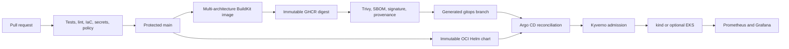

# Kube Aegis Forge

> A reproducible Kubernetes GitOps platform with verifiable security, delivery, and recovery controls.

[](https://github.com/murillo-consulting/kube-aegis-forge/actions/workflows/ci.yml)
[](https://github.com/murillo-consulting/kube-aegis-forge/actions/workflows/codeql.yml)
[](https://github.com/murillo-consulting/kube-aegis-forge/actions/workflows/e2e-local.yml)
[](LICENSE)

The mandatory acceptance path is local and free. A clean clone creates a three-node `kind` cluster, bootstraps Argo CD, reconciles the platform, and verifies the workload, policies, metrics, and self-healing behavior. AWS EKS remains an optional extension.

## What it proves

- **Delivery:** protected pull requests, parallel CI, multi-architecture images, GitOps reconciliation, and verified rollback.
- **Supply chain:** CodeQL, secret and dependency scanning, signed image digests, SBOMs, and SLSA provenance.
- **Runtime security:** hardened containers, Kyverno policies, restricted namespaces, and default-deny networking.
- **Operations:** Prometheus metrics, Grafana dashboards, health probes, pod replacement, and Argo CD self-healing.
- **Cloud security:** short-lived AWS OIDC roles, encrypted state, private nodes, audit logs, and mocked OpenTofu tests.

The [competency evidence matrix](docs/evidence.md) maps each claim to a repository artifact or reproducible check.

## Quick start

Requirements: Docker with at least 10 GiB available, Git, `kubectl`, Helm 4.2.3, kind 0.32.0, OpenTofu 1.12.5, and Task.

```bash
git clone https://github.com/murillo-consulting/kube-aegis-forge.git
cd kube-aegis-forge
task tools:check
task local:up && task local:verify
```

The API is then available at <http://localhost:8080>. The verification task checks every endpoint, all Argo applications, Kyverno rejection, the Prometheus target, pod replacement, and Argo self-healing.

Remove only this project’s cluster with `task local:down`.

## Delivery architecture



The CI identity cannot deploy to Kubernetes. It publishes verified artifacts and updates an environment digest in the generated `gitops` branch. Argo CD combines the immutable chart from `main` with that digest.

## Workload and security

Argo CD separates platform services from the application workload. The FastAPI service exposes:

| Endpoint | Purpose |
| --- | --- |
| `GET /` | Public name, version, and Git commit |
| `GET /health/live` | Process liveness |
| `GET /health/ready` | Traffic readiness |
| `GET /metrics` | Prometheus metrics |

The image runs as user and group `10001`, supports a read-only root filesystem, and drops every Linux capability. Kubernetes adds two replicas, probes, resource limits, a disruption budget, topology spreading, Pod Security `restricted`, default-deny networking, namespace quotas, and no automatic service-account token mount.

Releases are accepted only after tests, vulnerability scanning, SPDX SBOM generation, keyless Cosign signing, SLSA provenance, and independent verification. Kyverno also refuses mutable images and workloads missing the required runtime controls. See the [threat model](docs/threat-model.md) for trust boundaries and residual risk.

## Operations and rollback

| Task | Effect |
| --- | --- |
| `task local:up` | Creates the local cluster and bootstraps Argo CD |
| `task local:verify` | Runs the complete acceptance suite |
| `task local:status` | Shows nodes, applications, workloads, and endpoints |
| `task local:logs` | Follows workload logs |
| `task local:down` | Deletes only the named kind cluster |

Operational procedures live in the [runbooks](docs/runbooks/bootstrap.md). The [five-minute demonstration](docs/demo.md) provides a concise portfolio walkthrough.

Rollback selects a previously released digest, verifies its signature, SBOM, and provenance, then commits that digest to `gitops`. Argo CD reconciles the recorded state. See the [rollback runbook](docs/runbooks/rollback.md).

## Optional AWS EKS extension

The OpenTofu extension provisions encrypted, versioned state, separate GitHub OIDC identities for planning and applying changes, a two-zone VPC, private EKS nodes, audit logs, flow logs, and encrypted worker volumes. No public ingress is created by default, and no real AWS deployment is claimed. Review the [cloud-security proof](docs/runbooks/aws-security-review.md) and [destruction runbook](docs/runbooks/aws-destroy.md) before applying a plan.

## Repository map

```text
app/                     FastAPI source and tests
platform/                Helm, Argo CD, policies, and environments
infra/aws/               Optional state bootstrap and EKS modules
.github/workflows/       CI, release, promotion, and rollback
docs/                    ADRs, runbooks, threat model, and evidence
scripts/                 Cross-platform verification scripts
```


Version 1 intentionally excludes a public domain and TLS, databases, External Secrets, runtime threat detection, a service mesh, and a highly available multi-NAT AWS topology.

## Contributing and license

Read [CONTRIBUTING.md](CONTRIBUTING.md) before opening a pull request. Report vulnerabilities through [SECURITY.md](SECURITY.md). Licensed under [Apache-2.0](LICENSE).
