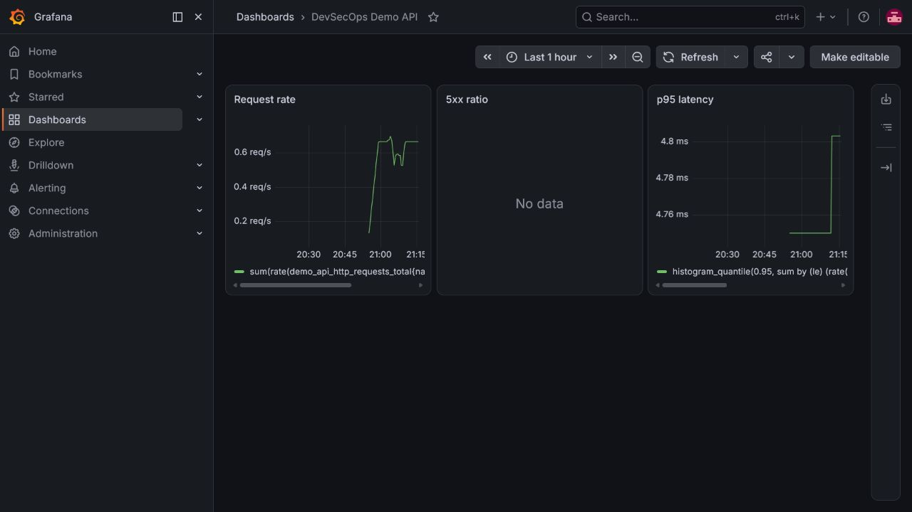

# Kube Aegis Forge

[](https://github.com/murillo-consulting/kube-aegis-forge/actions/workflows/ci.yml)
[](https://github.com/murillo-consulting/kube-aegis-forge/actions/workflows/codeql.yml)
[](https://github.com/murillo-consulting/kube-aegis-forge/actions/workflows/e2e-local.yml)
[](LICENSE)

A reproducible Kubernetes GitOps reference platform built with OpenTofu, Argo CD, GitHub Actions, signed container images, SBOMs, policy enforcement, and observability.

The mandatory acceptance path is local and free: a clean clone can create a three-node `kind` cluster, bootstrap Argo CD, reconcile the platform, and prove the workload, policies, metrics, and self-healing behavior. AWS EKS is an optional extension and is never required to validate the project.

## What this proves

| Engineering pillar | Demonstrated controls | Reproducible evidence |
|---|---|---|
| DevOps | Protected pull requests, parallel CI, multi-architecture builds, GitOps reconciliation, observability, self-healing, and verified rollback | `task local:verify`, GitHub Actions, Argo CD, Prometheus, and Grafana |
| DevSecOps | CodeQL SAST, dependency and secret scanning, IaC scanning, hardened containers, policy as code, signed digests, SBOMs, and provenance | `task security:check`, Kyverno negative tests, Cosign verification, and the release workflow |
| Cloud Security | Short-lived AWS OIDC, separate plan/apply identities, approval gates, KMS-encrypted state and EKS secrets, narrow API CIDRs, private nodes, EKS audit logs, VPC Flow Logs, and IMDSv2 | Mocked OpenTofu tests and Trivy IaC checks; no AWS deployment is claimed |

## Quick start

Prerequisites:

- Docker with at least 10 GiB available;
- Git, `kubectl`, Helm 4.2.3, kind 0.32.0, OpenTofu 1.12.5, and Task;
- ports `8080`, `8443`, `3000`, and `9090` available when their related task is used.

```bash
git clone https://github.com/murillo-consulting/kube-aegis-forge.git && cd kube-aegis-forge
task tools:check
task local:up && task local:verify
```

The API is then available at <http://localhost:8080>. The verification task checks every endpoint, all Argo applications, Kyverno rejection, the Prometheus target, pod replacement, and Argo self-healing.

Remove only this project's cluster:

```bash
task local:down
```

## Delivery architecture

```mermaid
flowchart LR
    Dev["Pull request"] --> CI["Tests, lint, IaC, secrets, policy"]
    CI --> Main["Protected main"]
    Main --> Build["One amd64/arm64 BuildKit build"]
    Build --> GHCR["Immutable GHCR digest"]
    GHCR --> Scan["Trivy vulnerability gate"]
    Scan --> Evidence["Syft SBOM, Cosign signature, GitHub provenance"]
    Evidence --> Verify["Signature, SBOM, provenance verification"]
    Verify --> GitOps["Generated gitops branch"]
    Main --> Chart["Immutable OCI Helm chart"]
    GitOps --> Argo["Argo CD multi-source reconciliation"]
    Chart --> Argo
    Argo --> Policy["Kyverno admission"]
    Policy --> K8s["kind or optional EKS"]
    K8s --> Observe["Prometheus, Grafana, alert rules"]
```



The CI identity cannot deploy to Kubernetes. It may only publish verified artifacts and update an environment digest in the generated `gitops` branch. Argo CD combines the immutable OCI chart built from `main` with that digest. The chart and workload revision are therefore independently auditable without asking Argo CD to resolve two revisions of the same Git repository.

## What is deployed

Argo CD uses an app-of-apps hierarchy and two projects:

- `platform` owns ingress-nginx, Kyverno, metrics-server, kube-prometheus-stack, and cluster policies;
- `workloads` is restricted to the `demo` namespace and the application repository.

The FastAPI workload exposes:

| Endpoint | Contract |
|---|---|
| `GET /` | Public name, version, and Git commit only |
| `GET /health/live` | Process liveness |
| `GET /health/ready` | Traffic readiness |
| `GET /metrics` | Bounded-cardinality Prometheus metrics |

The image runs as UID/GID `10001`, has no package manager additions, supports a read-only root filesystem, and is deployed with all Linux capabilities dropped. Kubernetes adds two replicas, probes, requests and limits, a PDB, topology spreading, Pod Security `restricted`, default-deny network policy, namespace quotas, default limits, and no automatic service-account token mount.

## Security and supply chain

Pull requests run CodeQL, locked Python tests, Helm/Kyverno validation, OpenTofu tests, Gitleaks, Trivy filesystem scanning, and a dedicated Trivy IaC misconfiguration gate. Every release must then pass the following order before the GitOps state can change:

1. Ruff, mypy, pytest, and at least 90% coverage;
2. image build and push by immutable digest;
3. no fixable High or Critical vulnerability according to Trivy;
4. SPDX JSON SBOM generation with Syft;
5. keyless Cosign signature from the exact `release.yml` workflow identity;
6. GitHub SLSA provenance attached to the OCI digest;
7. independent signature, SBOM attestation, and provenance verification;
8. commit of the digest to `gitops`.

Kyverno independently refuses mutable images and workloads without the required runtime controls. The application image must also carry the expected keyless signature and SLSA provenance. See the [threat model](docs/threat-model.md) for trust boundaries, abuse cases, and residual risk.

The hosted, ephemeral GitHub build and platform-signed provenance meet the documented requirements for **SLSA Build L2**. The project does not claim L3: dependency downloads and the GitHub Actions cache make the build non-hermetic.

Verify a published digest from a trusted shell:

```bash
export GITHUB_REPOSITORY=murillo-consulting/kube-aegis-forge
bash scripts/verify-artifact.sh \
  ghcr.io/murillo-consulting/kube-aegis-forge@sha256:REPLACE_WITH_64_HEX_CHARACTERS
```

Releases use `ghcr.io/murillo-consulting/kube-aegis-forge` and are bound to the
repository's release workflow identity.

## Operations

| Task | Effect |
|---|---|
| `task local:up` | Creates or reuses only `kube-aegis-forge`, installs Argo CD, and applies the root app |
| `task local:verify` | Runs the complete local acceptance suite |
| `task local:status` | Shows nodes, Argo applications, workloads, and endpoints |
| `task local:logs` | Follows workload logs |
| `task local:port-forward:argocd` | Exposes Argo CD at `https://localhost:8443` |
| `task local:port-forward:grafana` | Exposes Grafana at `http://localhost:3000` |
| `task local:port-forward:prometheus` | Exposes Prometheus at `http://localhost:9090` |
| `task local:down` | Deletes only the named kind cluster |

Operational procedures live in [docs/runbooks](docs/runbooks/bootstrap.md). The [five-minute demonstration](docs/demo.md) provides a concise portfolio walkthrough.

## Rollback

Rollback is a verified GitOps change, not `argocd rollback`:

1. select the artifact repository and a previously released digest in the `Roll back GitOps digest` workflow;
2. the workflow re-verifies the signature, SBOM, and provenance;
3. it commits the previous digest to `gitops`;
4. Argo CD reconciles the desired state and records the rollback in Git history.

This avoids fighting automated synchronization and preserves an auditable recovery path. See the [rollback runbook](docs/runbooks/rollback.md).

## Optional AWS EKS extension

`infra/aws/bootstrap` creates a retained, versioned S3 state bucket encrypted by a rotating customer-managed KMS key and separate GitHub OIDC roles for plan and apply. The roles use regional, service-specific policies instead of `ReadOnlyAccess` or `PowerUserAccess`; the plan identity may read state and manage only its native lock object, while only the apply identity may write state. `infra/aws/eks` creates a two-AZ VPC, private nodes, one demonstration NAT Gateway, EKS 1.36, required add-ons, and a two-node `t3.medium` managed node group with min/max 1/3.

The private API endpoint is enabled. Public API access requires IPv4 `/24`-or-narrower or IPv6 `/64`-or-narrower CIDRs. Cluster administration is granted through an explicit EKS access entry rather than implicit creator-admin rights. EKS Pod Identity is installed while legacy IRSA is disabled, avoiding an unused cluster OIDC provider. All five EKS control-plane log types, VPC Flow Logs, rotating KMS secret encryption, encrypted worker volumes, and IMDSv2 are explicit and covered by mocked tests.

No public AWS ingress is created by default, and no long-lived AWS key belongs in GitHub. AWS resources cost money; this repository has not deployed them. Review the plan, the [offline cloud-security proof](docs/runbooks/aws-security-review.md), and the [AWS destruction runbook](docs/runbooks/aws-destroy.md) before applying.

## Repository map

```text
app/                     FastAPI source, lock file, and tests
platform/charts/         Application Helm chart
platform/argocd/         Common and environment app-of-apps definitions
platform/policies/       Kyverno policies and policy tests
platform/environments/   Human values on main; generated digests on gitops
platform/kind/           Pinned local cluster configuration
infra/aws/bootstrap/     Retained state and GitHub OIDC bootstrap
infra/aws/eks/           Optional VPC and EKS root module
.github/workflows/       CI, release, E2E, promotion, rollback, and AWS workflows
docs/                    ADRs, runbooks, threat model, evidence, and demo
scripts/                 Cross-platform operational and verification scripts
```

## Evidence and limitations

The [competency evidence matrix](docs/evidence.md) maps every portfolio claim to a repository artifact or reproducible check. The evidence below was captured from the real validated repository and local kind cluster; no placeholder or mock dashboard is used.

- CI, CodeQL, release, and fresh-cluster GitOps E2E checks run from the
  repository's [Actions page](https://github.com/murillo-consulting/kube-aegis-forge/actions).
- Published images and their attestations are available from the
  [GHCR package](https://github.com/users/murillo-consulting/packages/container/package/kube-aegis-forge).



The Kyverno negative control is exercised automatically by `task local:verify` and the fresh-cluster E2E workflow. Its expected admission rejection stays in the test logs instead of being presented as a deployment failure on this landing page.

Version 1 intentionally excludes a public domain and TLS, databases, External Secrets, runtime threat detection, a service mesh, and a highly available multi-NAT AWS topology. AWS evidence is limited to validated code, mocked plans, policy scans, and documented controls; no real cloud deployment is claimed.

## Contributing and license

Read [CONTRIBUTING.md](CONTRIBUTING.md) before opening a pull request and report vulnerabilities through [SECURITY.md](SECURITY.md). Licensed under [Apache-2.0](LICENSE).
