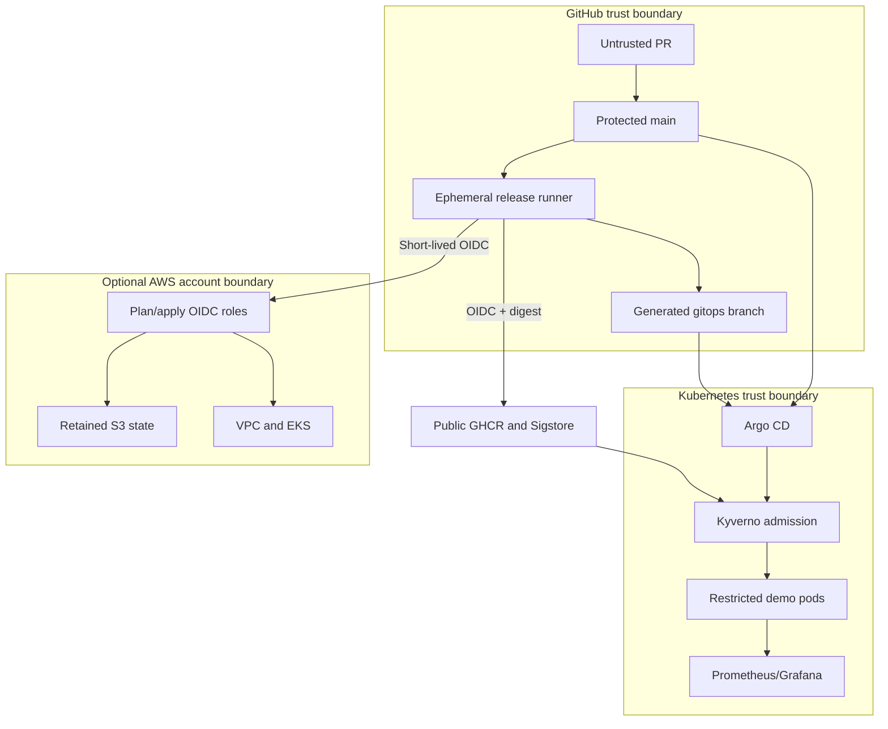

# Threat model

## Scope and security objectives

This model covers GitHub Actions, GHCR, the generated GitOps branch, Argo CD, Kyverno admission, the `demo` workload, observability, and the optional AWS bootstrap/EKS roots. The main objectives are artifact integrity, least-privilege deployment, recovery through auditable state, and prevention of credential disclosure.

Out of scope for v1: a public domain and TLS, application data stores, tenant isolation, end-user authentication, public AWS ingress, service mesh, and multi-region disaster recovery.

## Actors and protected assets

| Actor | Capability | Trust level |
|---|---|---|
| Repository maintainer | Reviews and merges code; configures environments | High, human-controlled |
| Pull-request author | Proposes arbitrary repository changes | Untrusted until review |
| GitHub Actions runner | Executes pinned workflow code with job-scoped tokens | Ephemeral, privileged per job |
| Argo CD controller | Reads public Git and mutates the target cluster | Cluster privileged |
| Cluster user | May submit Kubernetes resources according to RBAC | Partially trusted |
| External attacker | Can access public Git/GHCR and the local HTTP demo when exposed | Untrusted |
| AWS operator | Bootstraps state and configures GitHub OIDC | High, temporary privilege |

Critical assets are the protected branches, workflow definitions, `GITHUB_TOKEN`, OIDC trust policies, GHCR digests and attestations, GitOps desired state, Argo/Kyverno service accounts, AWS state, and admission/audit evidence.

## Trust boundaries and data flow

## STRIDE analysis by component

| Component | S | T | R | I | D | E | Primary controls |
|---|---:|---:|---:|---:|---:|---:|---|
| GitHub repository/workflows | High | High | Medium | Medium | Medium | High | Protected main, CODEOWNERS, SHA-pinned Actions, read-only defaults, CodeQL |
| Release runner and GHCR | High | High | Medium | Medium | Medium | High | OIDC, digest references, Trivy, signature, SBOM, provenance |
| GitOps branch and Argo CD | Medium | High | High | Low | Medium | High | Generated state, commit history, projects, no CI kubeconfig, self-heal |
| Kyverno admission | Medium | High | Medium | Low | High | High | Fail-closed webhook, two replicas, restricted policies, negative tests |
| Demo workload | Low | Medium | Low | Medium | Medium | Medium | PSS restricted, non-root, read-only, default-deny, quotas, no service-account token |
| Monitoring | Low | Medium | Low | Medium | Medium | Medium | Port-forward only, generated admin secret, NetworkPolicy |
| AWS state and EKS | High | High | High | High | High | High | Service-specific OIDC roles, protected environments, rotating KMS, explicit access entry, audit/flow logs, CIDR allowlist |

## Threat register

| ID | STRIDE | Scenario | Likelihood | Impact | Risk | Mitigation and verification | Residual risk |
|---|---|---|---|---|---|---|---|
| T-01 | S/E | A PR changes a third-party Action tag to execute attacker code | Medium | Critical | High | All `uses:` references are full SHAs; CODEOWNERS and CI review workflow changes | A trusted upstream commit can still be malicious |
| T-02 | E | A pull request obtains release or AWS credentials | Low | Critical | High | Privileged workflows run only from protected `main` or approval-gated environments; tokens use job permissions | Maintainer account compromise remains material |
| T-03 | T | An image tag is moved after approval | High | High | High | Helm deploys `repository@sha256`; Kyverno rejects non-digest images | Registry denial can prevent new scheduling |
| T-04 | S/T | An unrelated workflow signs a malicious image | Medium | Critical | High | Cosign and Kyverno match the exact repository, workflow path, issuer, and main ref | Workflow compromise at that exact identity remains trusted |
| T-05 | T/R | Promotion occurs before scanning or attestation | Low | Critical | High | Release ordering verifies scan, SBOM, signature, and provenance before the only GitOps write step | A bypass by a maintainer with branch-write access is possible |
| T-06 | E | CI deploys directly and bypasses Git review | Low | High | Medium | CI has no kubeconfig; Argo CD is the sole deployer; application projects constrain destinations | Argo's cluster privilege is a high-value target |
| T-07 | E/T | A cluster user deploys privileged or mutable workloads | Medium | High | High | PSS restricted plus Kyverno rules for digest, probes, resources, non-root, seccomp, read-only root, and dropped capabilities | Admission outage can block legitimate deployments by design |
| T-08 | I | Metrics or root metadata leaks secrets | Low | Medium | Low | The app has no secrets, returns only allowlisted build metadata, and labels metrics with bounded route templates | Future endpoints must repeat the review |
| T-09 | D | A pod or manifest is deleted or drifted | Medium | Medium | Medium | Two replicas, PDB, topology spread, controller reconciliation, Argo self-heal; local verification deletes a pod and patches replicas | Simultaneous node/control-plane loss exceeds local HA claims |
| T-10 | I/E | A committed AWS key gives persistent account access | Low | Critical | High | OIDC only; no long-lived keys; Gitleaks scans full history | External operator workstations are outside repository controls |
| T-11 | T/R | An altered OpenTofu plan is applied after approval | Low | Critical | High | The plan artifact is hashed, retained one day, re-hashed after download, and applied directly | GitHub artifact service compromise is inherited risk |
| T-12 | D/T | EKS destroy also removes audit state | Low | High | Medium | State bootstrap is a separate root, bucket has versioning and `prevent_destroy`, and deletion is a separate runbook | Account closure or administrator deletion can still remove it |
| T-13 | S | A permissive GitHub OIDC subject is reused from another branch/repository | Low | Critical | High | Trust matches repository plus environment; environment deployment branches are restricted to `main` | Misconfigured GitHub environment protection weakens the control |
| T-14 | I | Grafana or Argo is exposed publicly with default credentials | Low | High | Medium | No ingress for either UI; access is port-forward only; Grafana secret is CSPRNG-generated outside Git | Local host compromise can access forwarded ports |
| T-15 | E | The EKS creator retains undocumented permanent cluster-admin access | Medium | Critical | High | Creator-admin is disabled; one validated IAM role is granted through an explicit EKS access entry | Compromise of the named administrator role remains critical |
| T-16 | R/I | AWS network or Kubernetes API activity cannot be reconstructed after an incident | Medium | High | High | All EKS control-plane logs and VPC Flow Logs are enabled with 30-day retention; state is versioned and KMS encrypted | No central SIEM or cross-account log archive is included in v1 |

## Verification and review triggers

Automated evidence comes from CodeQL, CI, policy tests, OpenTofu mocked tests, Trivy IaC scanning, release verification, and `task local:verify`. Review this model when a new external service, secret, public endpoint, workload namespace, signing identity, AWS role, or cluster administrator is added, and after any relevant supply-chain incident.
